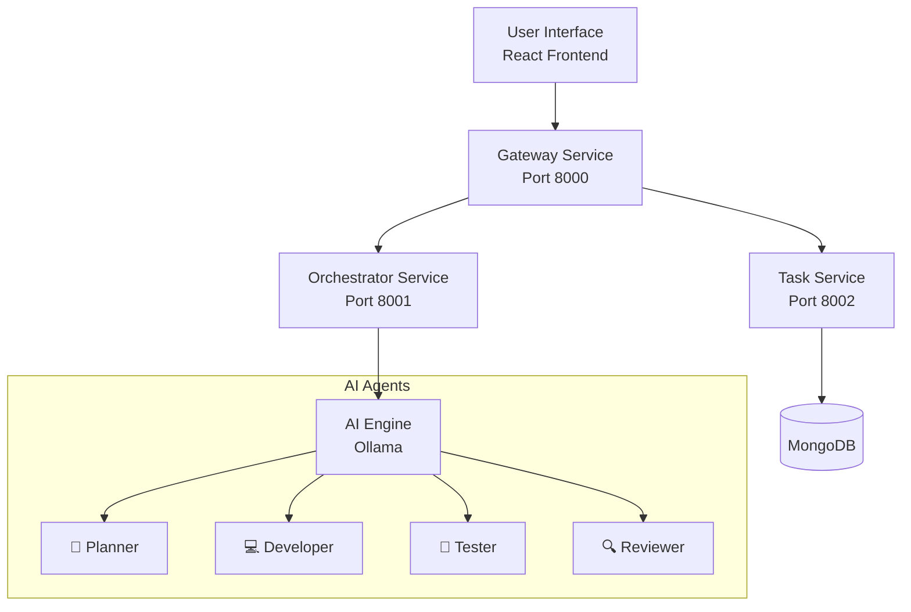

# 🚀 Human-AI Collaboration App

A sophisticated microservices-based platform that simulates a virtual AI development team capable of planning, coding, testing, and reviewing software projects.

## 📋 Table of Contents

- [Overview](#overview)
- [Architecture](#architecture)
- [Features](#features)
- [Quick Start](#quick-start)
- [Management Scripts](#-management-scripts)
- [Services](#services)
- [Development](#development)
- [API Documentation](#api-documentation)
- [Contributing](#contributing)
- [License](#license)

## 🎯 Overview

The Human-AI Collaboration App creates a virtual software development team powered by AI agents. Users can submit high-level project goals, and the system orchestrates specialized AI agents to:

- 🎯 **Plan** technical architecture and project roadmap
- 💻 **Develop** production-ready code
- 🧪 **Test** with comprehensive test suites
- 🔍 **Review** code quality and security

### Key Benefits

- **Rapid Prototyping**: Get from idea to working code in minutes
- **Learning Tool**: Understand software architecture patterns
- **Code Quality**: Professional reviews and suggestions
- **Comprehensive Testing**: Automated test generation

## 🏗️ Architecture



### Service Architecture

| Service | Port | Responsibility | Technology |
|---------|------|----------------|------------|
| **Frontend** | 3000 | User Interface | React 18 |
| **Gateway** | 8000 | API Gateway & Load Balancer | FastAPI |
| **Orchestrator** | 8001 | AI Agent Management | FastAPI + Ollama |
| **Task** | 8002 | Data Persistence | FastAPI + MongoDB |

## ✨ Features

### 🤖 AI Agent Team
- **Planner Agent**: Creates detailed technical specifications
- **Developer Agent**: Writes production-ready code
- **Tester Agent**: Generates comprehensive test suites
- **Reviewer Agent**: Conducts thorough code reviews

### 🛠️ Technical Features
- **Microservices Architecture**: Scalable and maintainable
- **Real-time Processing**: Live updates during AI processing
- **Persistent Storage**: Chat history and project data
- **Health Monitoring**: Service status and diagnostics
- **Error Handling**: Comprehensive error management
- **Type Safety**: Pydantic models for validation

### 🎨 User Experience
- **Intuitive Chat Interface**: Natural conversation with AI team
- **Real-time Feedback**: Live processing indicators
- **Code Highlighting**: Syntax highlighting for generated code
- **Export Options**: Download generated code and documentation
- **Responsive Design**: Works on desktop and mobile

## 🚀 Quick Start

> Current automation note: the reliable path is Docker Compose through
> `start.ps1` / `test.ps1` / `stop.ps1` on Windows, or
> `start.sh` / `test.sh` / `stop.sh` in Bash. See [SCRIPTS.md](SCRIPTS.md)
> and [docs/scripts-documentation.md](docs/scripts-documentation.md) for the
> corrected commands.

### Prerequisites

- **Docker Desktop** with WSL2 integration enabled
- **Node.js 18+** (for frontend development)
- **Python 3.10+** (for backend development)
- **Git** for version control

### 1. Clone Repository

```bash
git clone https://github.com/ZeeshanAhmedDev/Human-Ai-Collaboration-app.git
cd Human-Ai-Collaboration-app
```

### 2. Start the Complete Platform

The platform includes automated scripts for easy management:

```bash
# 🚀 Start all services (MongoDB, Ollama, Backend APIs, Frontend)
./start.sh

# 🧪 Test that everything is working
./test.sh

# 🛑 Stop all services cleanly
./stop.sh
```

### 3. Access the Application

- **🌐 Frontend**: http://localhost:3000
- **🚪 Gateway API**: http://localhost:8000
- **🤖 Orchestrator**: http://localhost:8001
- **💾 Task Service**: http://localhost:8002
- **🗄️ MongoDB**: mongodb://localhost:27017
- **🧠 Ollama AI**: http://localhost:11434

## 📜 Management Scripts

### `start.sh` - Complete Platform Startup

Automated startup script that:

1. **Checks Docker availability** and WSL2 integration
2. **Starts dependencies** (MongoDB 7.0 + Ollama with qwen2.5-coder model)
3. **Waits for services** to be ready with health checks
4. **Downloads AI model** (qwen2.5-coder:1.5b-instruct) automatically
5. **Starts backend services** in Python virtual environments
6. **Launches React frontend** with hot reload
7. **Performs health checks** on all endpoints
8. **Opens browser** automatically to the application

**Usage:**
```bash
./start.sh
```

**Features:**
- ✅ Automatic dependency management
- ✅ Health checks and readiness waiting
- ✅ Colored output with status indicators
- ✅ PID management for process tracking
- ✅ Error handling and recovery
- ✅ Cross-platform compatibility (WSL2/Linux)

### `stop.sh` - Clean Shutdown

Gracefully stops all services:

1. **Terminates backend processes** using stored PIDs
2. **Stops Docker containers** (MongoDB, Ollama)
3. **Removes networks and volumes** (optional)
4. **Cleans up process files**

**Usage:**
```bash
./stop.sh
```

### `test.sh` - Health and Functionality Testing

Comprehensive testing script that validates:

1. **Docker services** (MongoDB, Ollama containers)
2. **API health endpoints** (Gateway, Orchestrator, Task services)
3. **Database connectivity** (MongoDB ping)
4. **AI service availability** (Ollama model status)
5. **Frontend accessibility** (React development server)
6. **Complete workflow** (goal execution through API)

**Usage:**
```bash
./test.sh
```

**Sample Output:**
```
🧪 Testing AI Collaboration Platform...
====================================
[PASS] MongoDB container is running
[PASS] Ollama container is running
[PASS] Gateway service health check passed
[PASS] Orchestrator service health check passed
[PASS] Task service health check passed
[PASS] MongoDB connection successful
[PASS] Ollama service is responding
[PASS] Frontend is accessible
[PASS] Goal execution flow working
```

### Docker Dependencies Configuration

The platform uses `docker-compose.dependencies.yml` for infrastructure services:

```yaml
services:
  mongodb:
    image: mongo:7.0
    container_name: ai-collaboration-mongodb
    ports:
      - "27017:27017"
    environment:
      MONGO_INITDB_DATABASE: ai_collab_team
    volumes:
      - mongodb_data:/data/db
      - ./scripts/mongo-init.js:/docker-entrypoint-initdb.d/mongo-init.js:ro
    healthcheck:
      test: ["CMD", "mongosh", "--eval", "db.adminCommand('ping')"]
      interval: 10s
      timeout: 5s
      retries: 5

  ollama:
    image: ollama/ollama:latest
    container_name: ai-collaboration-ollama
    ports:
      - "11434:11434"
    volumes:
      - ollama_data:/root/.ollama
    healthcheck:
      test: ["CMD", "curl", "-f", "http://localhost:11434/api/version"]
      interval: 30s
      timeout: 10s
      retries: 3
```

### Environment Setup

Each backend service runs in its own Python virtual environment:

```bash
# Virtual environments structure
gateway_service/venv/        # Gateway API environment
orchestrator_service/venv/   # AI orchestration environment  
task_service/venv/          # Task management environment
```

**Dependencies automatically installed:**
- FastAPI + Uvicorn (web framework)
- Pydantic + Pydantic-settings (data validation)
- PyMongo (MongoDB driver)
- Requests (HTTP client)
- And more...

### Configuration

The platform supports extensive customization through environment variables:

```bash
# Copy configuration template
cp .env.example .env

# Edit configuration
nano .env
```

**Key configuration options:**
- **Database**: MongoDB connection, database name
- **AI Service**: Ollama host, model selection
- **Ports**: Service port assignments
- **Resources**: Memory and CPU limits
- **Security**: Authentication, CORS settings
- **Performance**: Worker counts, timeouts

See [.env.example](.env.example) for all available options.

- **Frontend**: http://localhost:3000
- **Gateway API**: http://localhost:8000
- **API Documentation**: http://localhost:8000/docs

### 5. Manual Setup (Development)

<details>
<summary>Click to expand manual setup instructions</summary>

#### Backend Services

```bash
# Gateway Service
cd gateway_service
pip install -r requirements.txt
uvicorn app.main:app --host 0.0.0.0 --port 8000

# Orchestrator Service
cd orchestrator_service
pip install -r requirements.txt
uvicorn app.main:app --host 0.0.0.0 --port 8001

# Task Service
cd task_service
pip install -r requirements.txt
uvicorn app.main:app --host 0.0.0.0 --port 8002
```

#### Frontend

```bash
cd frontend
npm install
npm start
```

#### Ollama Setup

```bash
# Install Ollama
curl -fsSL https://ollama.ai/install.sh | sh

# Pull the coding model
ollama pull qwen3-coder:480b-cloud

# Start Ollama server
ollama serve
```

</details>

## 🔧 Services

### Gateway Service (Port 8000)
- **Role**: API Gateway and Request Router
- **Features**: CORS handling, error management, service coordination
- **Endpoints**: `/api/execute`, `/api/health`

### Orchestrator Service (Port 8001)
- **Role**: AI Agent Management and Coordination
- **Features**: Agent orchestration, AI model integration, response processing
- **AI Model**: Qwen3-Coder (specialized for coding tasks)

### Task Service (Port 8002)
- **Role**: Data Persistence and Management
- **Features**: MongoDB integration, task storage, history management
- **Database**: MongoDB with connection pooling

### Frontend (Port 3000)
- **Role**: User Interface and Experience
- **Features**: React hooks, context management, real-time updates
- **Technologies**: React 18, modern CSS, responsive design

## 🛠️ Development

### Project Structure

```
Human-Ai-Collaboration-app/
├── 📁 frontend/                 # React frontend application
│   ├── 📁 src/
│   │   ├── 📁 components/       # React components
│   │   ├── 📁 contexts/         # React contexts
│   │   ├── 📁 hooks/           # Custom hooks
│   │   ├── 📁 services/        # API services
│   │   ├── 📁 utils/           # Utility functions
│   │   └── 📁 styles/          # CSS styles
│   └── 📄 package.json
├── 📁 gateway_service/          # API Gateway service
│   ├── 📁 app/
│   │   ├── 📁 models/          # Pydantic models
│   │   ├── 📁 services/        # Business logic
│   │   ├── 📁 middleware/      # Custom middleware
│   │   └── 📁 config/          # Configuration
│   └── 📁 tests/               # Test files
├── 📁 orchestrator_service/     # AI orchestration service
│   ├── 📁 app/
│   │   ├── 📁 services/        # AI and agent services
│   │   └── 📁 models/          # Request/response models
│   └── 📁 tests/
├── 📁 task_service/            # Data persistence service
│   ├── 📁 app/
│   │   ├── 📁 services/        # Database services
│   │   └── 📁 models/          # Data models
│   └── 📁 tests/
├── 📄 docker-compose.yml       # Container orchestration
├── 📄 .env.example            # Environment template
└── 📄 README.md               # This file
```

### Code Quality

- **Type Safety**: Pydantic models for all APIs
- **Error Handling**: Comprehensive middleware
- **Testing**: Unit and integration tests
- **Documentation**: Inline comments and docstrings
- **Linting**: Code style enforcement

### Development Workflow

1. **Feature Branch**: Create feature branch from `main`
2. **Development**: Implement feature with tests
3. **Testing**: Run test suite and manual testing
4. **Documentation**: Update relevant documentation
5. **Pull Request**: Submit for code review
6. **Deployment**: Deploy to staging, then production

## 📚 API Documentation

### Gateway Service Endpoints

| Method | Endpoint | Description |
|--------|----------|-------------|
| POST | `/api/execute` | Execute goal through AI team |
| GET | `/api/health` | Service health check |

### Example API Usage

```bash
# Execute a goal
curl -X POST "http://localhost:8000/api/execute" \
  -H "Content-Type: application/json" \
  -d '{"goal": "Create a REST API for user authentication"}'

# Health check
curl -X GET "http://localhost:8000/api/health"
```

### Response Format

```json
{
  "goal": "Create a REST API for user authentication",
  "plan": "Detailed technical architecture...",
  "code": "Production-ready implementation...",
  "tests": "Comprehensive test suite...",
  "review": "Code quality review...",
  "timestamp": "2025-10-19T10:30:00Z"
}
```

## 🔧 Configuration

### Environment Variables

| Variable | Service | Description | Default |
|----------|---------|-------------|---------|
| `MONGO_URI` | Task | MongoDB connection string | Required |
| `OLLAMA_HOST` | Orchestrator | Ollama server URL | `http://host.docker.internal:11434` |
| `GATEWAY_DEBUG` | Gateway | Enable debug mode | `false` |

### Model Configuration

The system uses **Qwen3-Coder** model optimized for coding tasks:
- **Specialization**: Code generation, testing, review
- **Temperature**: 0.7 (balanced creativity/consistency)
- **Max Tokens**: 2000 (sufficient for most code tasks)

## 🐛 Troubleshooting

### Common Issues

<details>
<summary>Service Connection Errors</summary>

**Problem**: Cannot connect to backend services

**Solutions**:
1. Check if all services are running: `docker-compose ps`
2. Verify ports are not in use: `netstat -tulpn | grep :8000`
3. Check service logs: `docker-compose logs gateway_service`
4. Restart services: `docker-compose restart`

</details>

<details>
<summary>AI Model Issues</summary>

**Problem**: AI responses are slow or failing

**Solutions**:
1. Check Ollama status: `ollama list`
2. Verify model is downloaded: `ollama pull qwen3-coder:480b-cloud`
3. Restart Ollama: `ollama serve`
4. Check orchestrator logs for AI errors

</details>

<details>
<summary>Database Connection Issues</summary>

**Problem**: Cannot connect to MongoDB

**Solutions**:
1. Verify MongoDB URI in `.env` file
2. Check MongoDB service status
3. Test connection manually
4. Review task service logs

</details>

## 🧪 Testing

### Run Tests

```bash
# Backend tests
cd gateway_service && python -m pytest
cd orchestrator_service && python -m pytest
cd task_service && python -m pytest

# Frontend tests
cd frontend && npm test

# Integration tests
docker-compose -f docker-compose.test.yml up
```

### Test Coverage

- **Unit Tests**: Individual component testing
- **Integration Tests**: Service interaction testing
- **API Tests**: Endpoint validation
- **Frontend Tests**: Component and utility testing

## 🤝 Contributing

We welcome contributions! Please see our [Contributing Guide](CONTRIBUTING.md) for details.

### Development Setup

1. Fork the repository
2. Create a feature branch
3. Make your changes
4. Add tests for new functionality
5. Ensure all tests pass
6. Submit a pull request

### Code Style

- **Python**: Follow PEP 8, use type hints
- **JavaScript**: Follow ESLint rules, use modern ES6+
- **Documentation**: Update relevant docs for changes
- **Testing**: Maintain test coverage above 80%

## 📄 License

This project is licensed under the MIT License - see the [LICENSE](LICENSE) file for details.

## 🙏 Acknowledgments

- **Ollama** for local AI model hosting
- **FastAPI** for high-performance API framework
- **React** for modern frontend development
- **MongoDB** for flexible data storage

## 🔗 Links

- **📜 Script Documentation**: [Complete Scripts Guide](docs/scripts-documentation.md)
- **🚀 Quick Scripts Reference**: [SCRIPTS.md](SCRIPTS.md)
- **📚 Full Documentation**: [Documentation](docs/)
- **🔌 API Reference**: [API Docs](http://localhost:8000/docs)
- **🐛 Issues**: [GitHub Issues](https://github.com/ZeeshanAhmedDev/Human-Ai-Collaboration-app/issues)
- **💬 Discussions**: [GitHub Discussions](https://github.com/ZeeshanAhmedDev/Human-Ai-Collaboration-app/discussions)

---

**Made with ❤️ by the AI Collaboration Team**
