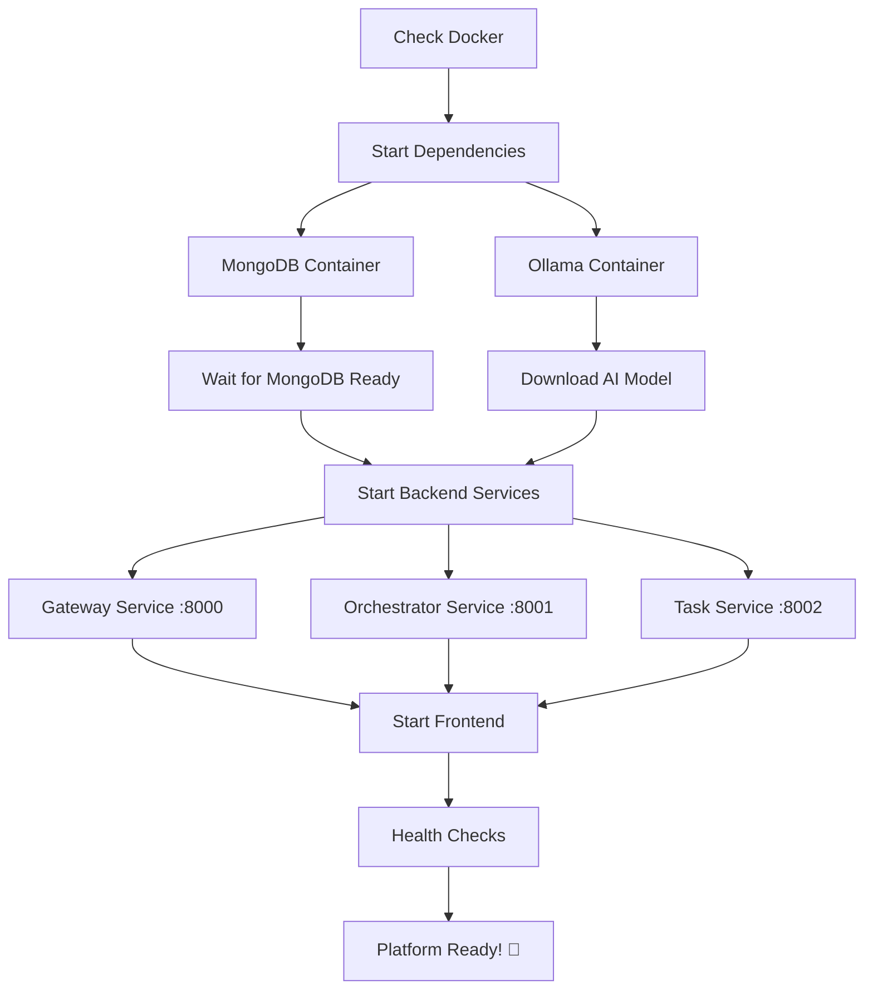
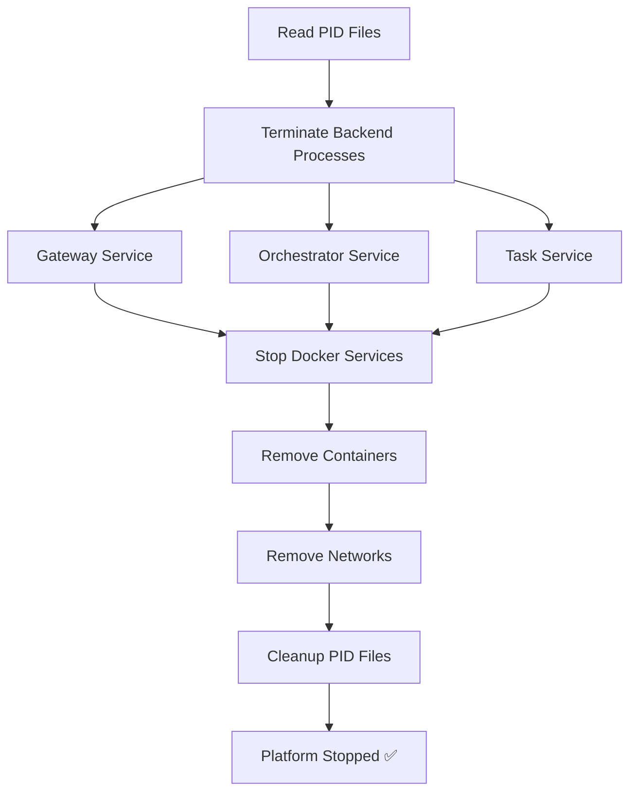

# 🛠️ Management Scripts Documentation

This document provides detailed information about the automated management scripts for the AI Collaboration Platform.

## 📋 Script Overview

The platform includes three main management scripts that automate the entire lifecycle:

| Script | Purpose | Usage |
|--------|---------|-------|
| `start.sh` | Complete platform startup | `./start.sh` |
| `stop.sh` | Clean shutdown | `./stop.sh` |
| `test.sh` | Health & functionality testing | `./test.sh` |

## 🚀 start.sh - Complete Platform Startup

### Description
Comprehensive startup script that orchestrates the entire AI Collaboration Platform including dependencies, backend services, and frontend.

### Features
- ✅ **Docker Integration**: Manages MongoDB and Ollama containers
- ✅ **AI Model Management**: Automatically downloads qwen2.5-coder:1.5b-instruct
- ✅ **Service Orchestration**: Starts all backend APIs in proper order
- ✅ **Health Monitoring**: Waits for services to be ready before proceeding
- ✅ **Process Management**: Tracks PIDs for clean shutdown
- ✅ **Error Handling**: Graceful failure recovery and reporting
- ✅ **Colored Output**: Visual status indicators for easy monitoring

### Execution Flow



### Prerequisites
- Docker Desktop with WSL2 integration enabled
- Sufficient disk space (≈3GB for Ollama model)
- Ports 3000, 8000, 8001, 8002, 11434, 27017 available

### Usage Examples

```bash
# Basic startup
./start.sh

# Check startup logs in real-time
./start.sh | tee startup.log

# Start in background (not recommended for development)
nohup ./start.sh > startup.log 2>&1 &
```

### Service URLs After Startup

| Service | URL | Description |
|---------|-----|-------------|
| Frontend | http://localhost:3000 | React UI |
| Gateway API | http://localhost:8000 | Main API gateway |
| Orchestrator | http://localhost:8001 | AI agent coordination |
| Task Service | http://localhost:8002 | Task management |
| MongoDB | mongodb://localhost:27017 | Database |
| Ollama | http://localhost:11434 | AI model server |

### Health Check Endpoints

```bash
# Verify all services are healthy
curl http://localhost:8000/health
curl http://localhost:8001/health  
curl http://localhost:8002/health
```

### Troubleshooting

#### Docker not available
```
[ERROR] Docker is not available or WSL2 integration is not enabled
```
**Solution**: Enable WSL2 integration in Docker Desktop Settings

#### Port conflicts
```
[ERROR] Port 8000 is already in use
```
**Solution**: Stop conflicting services or change ports in configuration

#### Model download failures
```
[ERROR] Failed to download Ollama model
```
**Solution**: Check internet connection and disk space (≈1GB required)

#### Service startup timeouts
```
[WARNING] Service may still be starting...
```
**Solution**: Wait longer or check service logs for errors

## 🛑 stop.sh - Clean Shutdown

### Description
Gracefully terminates all platform services, containers, and cleans up resources.

### Features
- ✅ **Process Termination**: Stops backend services using stored PIDs
- ✅ **Container Management**: Removes Docker containers and networks
- ✅ **Resource Cleanup**: Cleans up temporary files and processes
- ✅ **Graceful Shutdown**: Allows services to finish current operations

### Execution Flow



### Usage Examples

```bash
# Standard shutdown
./stop.sh

# Force shutdown (if services are unresponsive)
./stop.sh --force

# Stop only Docker services
docker-compose -f docker-compose.dependencies.yml down
```

### What Gets Stopped

1. **Backend Services**: All Python FastAPI processes
2. **Frontend**: React development server
3. **Docker Containers**: MongoDB and Ollama
4. **Networks**: AI collaboration network
5. **Volumes**: (Preserved by default for data persistence)

### Data Persistence

By default, the following data is preserved:
- **MongoDB data**: Stored in Docker volume `mongodb_data`
- **Ollama models**: Stored in Docker volume `ollama_data`
- **Frontend build**: Preserved in `frontend/build/`

## 🧪 test.sh - Health and Functionality Testing

### Description
Comprehensive testing script that validates all platform components and their interactions.

### Test Categories

#### 1. Infrastructure Tests
- Docker service availability
- Container health status
- Network connectivity

#### 2. Service Health Tests
- HTTP endpoint accessibility
- Response time validation
- Error handling verification

#### 3. Database Tests
- MongoDB connection
- Database operations
- Collection access

#### 4. AI Service Tests
- Ollama model availability
- API responsiveness
- Model inference capability

#### 5. Integration Tests
- End-to-end goal execution
- Service communication
- Data flow validation

### Usage Examples

```bash
# Run all tests
./test.sh

# Save test results
./test.sh > test-results.txt

# Run specific test categories
./test.sh --infrastructure-only
./test.sh --services-only
./test.sh --integration-only
```

### Test Output Example

```
🧪 Testing AI Collaboration Platform...
====================================
[TEST] Checking Docker services...
[PASS] MongoDB container is running
[PASS] Ollama container is running

[TEST] Testing service health endpoints...
[PASS] Gateway service health check passed
[PASS] Orchestrator service health check passed
[PASS] Task service health check passed

[TEST] Testing MongoDB connectivity...
[PASS] MongoDB connection successful

[TEST] Testing Ollama service...
[PASS] Ollama service is responding

[TEST] Testing Frontend accessibility...
[PASS] Frontend is accessible

[TEST] Testing complete goal execution flow...
[PASS] Goal execution flow working

[TEST] Test Summary:
=============
✅ All tests completed
🌐 Access the application at: http://localhost:3000
```

### Test Failure Diagnostics

#### Service Health Failures
```
[FAIL] Gateway service health check failed
```
**Diagnostics**:
- Check if service is running: `ps aux | grep uvicorn`
- Check logs: `tail -f gateway_service/logs/app.log`
- Verify port availability: `netstat -tlnp | grep 8000`

#### Database Connection Failures
```
[FAIL] MongoDB connection failed
```
**Diagnostics**:
- Check container status: `docker ps | grep mongodb`
- Check MongoDB logs: `docker logs ai-collaboration-mongodb`
- Test connection manually: `mongosh mongodb://localhost:27017`

#### AI Service Failures
```
[FAIL] Ollama service not responding
```
**Diagnostics**:
- Check container status: `docker ps | grep ollama`
- Check model status: `curl http://localhost:11434/api/tags`
- Verify model download: `docker logs ai-collaboration-ollama`

## 🔧 Advanced Usage

### Custom Configuration

#### Environment Variables
Create `.env` file for custom configuration:

```bash
# Database Configuration
MONGO_URI=mongodb://localhost:27017
DB_NAME=ai_collab_team

# AI Configuration  
OLLAMA_HOST=localhost
OLLAMA_PORT=11434
AI_MODEL=qwen2.5-coder:1.5b-instruct

# Service Ports
GATEWAY_PORT=8000
ORCHESTRATOR_PORT=8001
TASK_PORT=8002
FRONTEND_PORT=3000
```

#### Service-Specific Startup

```bash
# Start only backend services
cd gateway_service && source venv/bin/activate && uvicorn app.main:app --host 0.0.0.0 --port 8000 --reload &
cd orchestrator_service && source venv/bin/activate && uvicorn app.main:app --host 0.0.0.0 --port 8001 --reload &
cd task_service && source venv/bin/activate && uvicorn app.main:app --host 0.0.0.0 --port 8002 --reload &

# Start only frontend
cd frontend && npm start

# Start only dependencies
docker-compose -f docker-compose.dependencies.yml up -d
```

### Performance Monitoring

#### Resource Usage
```bash
# Monitor container resources
docker stats ai-collaboration-mongodb ai-collaboration-ollama

# Monitor process resources
ps aux | grep uvicorn
ps aux | grep node

# Monitor port usage
netstat -tlnp | grep -E "(3000|8000|8001|8002|11434|27017)"
```

#### Log Monitoring
```bash
# Real-time service logs
tail -f gateway_service/logs/app.log
tail -f orchestrator_service/logs/app.log
tail -f task_service/logs/app.log

# Docker container logs
docker logs -f ai-collaboration-mongodb
docker logs -f ai-collaboration-ollama

# Frontend logs (development server)
cd frontend && npm start
```

### Development Mode

#### Hot Reload Setup
All services support hot reload for development:

- **Backend**: FastAPI services automatically reload on code changes
- **Frontend**: React development server provides hot module replacement
- **AI Models**: Ollama automatically reloads model changes

#### Debug Mode
Enable debug logging:

```bash
# Set debug environment variables
export DEBUG=true
export LOG_LEVEL=debug

# Start services with debug flags
./start.sh --debug
```

## 📊 Monitoring and Observability

### Health Monitoring Endpoints

| Endpoint | Service | Information |
|----------|---------|-------------|
| `/health` | Gateway | Service status, database connectivity |
| `/health` | Orchestrator | Service status, AI connectivity |
| `/health` | Task | Service status, database operations |
| `/api/version` | Ollama | Model version, system info |

### Metrics Collection

```bash
# Service response times
curl -w "@curl-format.txt" -o /dev/null -s http://localhost:8000/health

# Database metrics
docker exec ai-collaboration-mongodb mongosh --eval "db.stats()"

# AI model metrics
curl -s http://localhost:11434/api/tags | jq '.models[].size'
```

### Log Aggregation

Centralized logging setup:

```bash
# Create logs directory
mkdir -p logs/{gateway,orchestrator,task,frontend}

# Redirect service logs
./start.sh 2>&1 | tee logs/platform.log

# Parse and analyze logs
grep ERROR logs/platform.log
grep WARNING logs/platform.log
grep SUCCESS logs/platform.log
```

## 🚨 Troubleshooting Guide

### Common Issues and Solutions

#### 1. Port Conflicts
**Problem**: Service fails to start due to port already in use
```bash
# Find process using port
lsof -i :8000
netstat -tlnp | grep 8000

# Kill conflicting process
kill -9 <PID>
```

#### 2. Docker Permission Issues
**Problem**: Docker commands fail with permission errors
```bash
# Add user to docker group
sudo usermod -aG docker $USER
newgrp docker

# Or use sudo (not recommended for development)
sudo ./start.sh
```

#### 3. Memory Issues
**Problem**: System runs out of memory during startup
```bash
# Check available memory
free -h

# Monitor memory usage during startup
watch -n 1 'free -h && docker stats --no-stream'

# Reduce Ollama model size
# Edit docker-compose.dependencies.yml to use smaller model
```

#### 4. Network Connectivity
**Problem**: Services can't communicate with each other
```bash
# Check Docker network
docker network ls
docker network inspect human-ai-collaboration-app_ai-collaboration-network

# Test connectivity between containers
docker exec ai-collaboration-mongodb ping ai-collaboration-ollama
```

#### 5. Model Download Issues
**Problem**: Ollama model fails to download
```bash
# Check internet connectivity
ping registry.ollama.ai

# Manually download model
docker exec ai-collaboration-ollama ollama pull qwen2.5-coder:1.5b-instruct

# Check model status
docker exec ai-collaboration-ollama ollama list
```

### Recovery Procedures

#### Complete Reset
```bash
# Stop all services
./stop.sh

# Remove all containers and volumes
docker-compose -f docker-compose.dependencies.yml down -v

# Remove virtual environments
rm -rf */venv

# Remove node modules
rm -rf frontend/node_modules

# Restart from scratch
./start.sh
```

#### Partial Reset
```bash
# Reset only backend services
pkill -f uvicorn
rm -f *.pid

# Reset only frontend
cd frontend && rm -rf node_modules package-lock.json
npm install

# Reset only Docker services
docker-compose -f docker-compose.dependencies.yml restart
```

## 📈 Performance Optimization

### Resource Allocation

#### Docker Resources
```yaml
# Optimize docker-compose.dependencies.yml
services:
  mongodb:
    deploy:
      resources:
        limits:
          memory: 512M
          cpus: '0.5'
        reservations:
          memory: 256M
          cpus: '0.25'
  
  ollama:
    deploy:
      resources:
        limits:
          memory: 2G
          cpus: '1.0'
        reservations:
          memory: 1G
          cpus: '0.5'
```

#### Python Services
```bash
# Optimize uvicorn workers
uvicorn app.main:app --workers 4 --host 0.0.0.0 --port 8000

# Use production ASGI server
gunicorn app.main:app -w 4 -k uvicorn.workers.UvicornWorker
```

### Caching Strategies

#### Model Caching
```bash
# Pre-load models to avoid cold starts
docker exec ai-collaboration-ollama ollama pull qwen2.5-coder:1.5b-instruct
docker exec ai-collaboration-ollama ollama run qwen2.5-coder:1.5b-instruct "test"
```

#### Database Indexing
```javascript
// MongoDB optimization
db.tasks.createIndex({ "created_at": -1 })
db.tasks.createIndex({ "user_id": 1, "session_id": 1 })
db.tasks.createIndex({ "status": 1 })
```

## 🔒 Security Considerations

### Production Deployment

#### Environment Security
```bash
# Use secure environment variables
export MONGO_USERNAME=admin
export MONGO_PASSWORD=$(openssl rand -base64 32)
export JWT_SECRET=$(openssl rand -base64 64)
```

#### Network Security
```yaml
# Production docker-compose.yml
services:
  mongodb:
    environment:
      MONGO_INITDB_ROOT_USERNAME: ${MONGO_USERNAME}
      MONGO_INITDB_ROOT_PASSWORD: ${MONGO_PASSWORD}
    networks:
      - internal
  
networks:
  internal:
    driver: bridge
    internal: true
```

#### API Security
```python
# Add authentication middleware
from fastapi import FastAPI, Depends, HTTPException
from fastapi.security import HTTPBearer

security = HTTPBearer()

@app.middleware("http")
async def auth_middleware(request: Request, call_next):
    # Implement authentication logic
    response = await call_next(request)
    return response
```

---

## 📞 Support

For issues with the management scripts:

1. **Check logs**: `./test.sh` for diagnostic information
2. **Review documentation**: This file and main README.md
3. **Check system requirements**: Docker, Node.js, Python versions
4. **Create issue**: GitHub issues with script output and system info

---

*Last Updated: October 19, 2025*
*Version: 1.0.0*